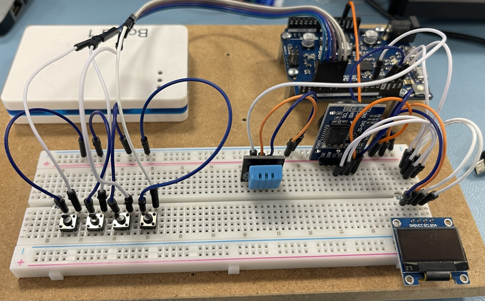
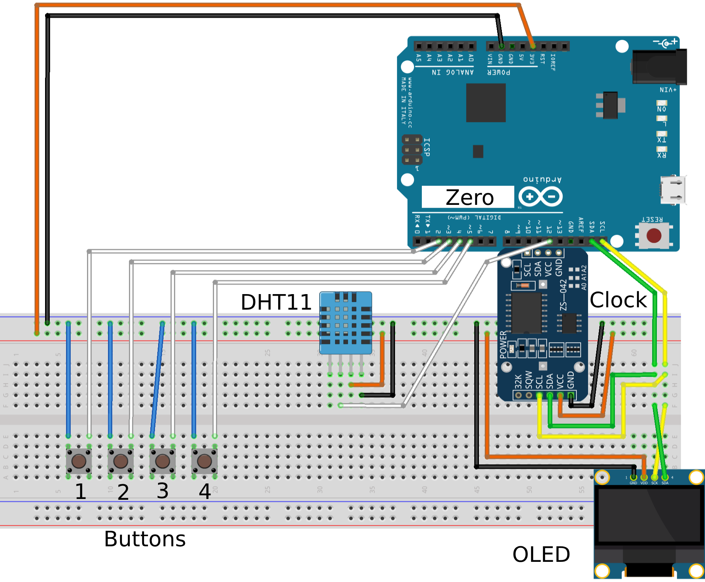
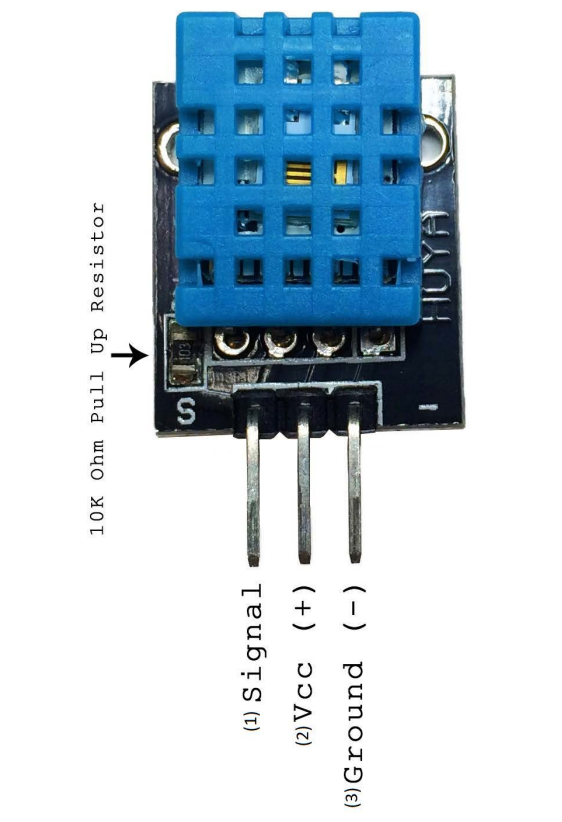
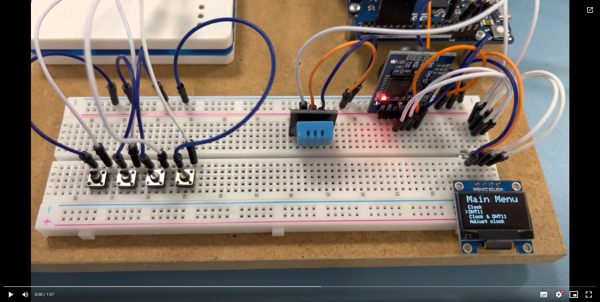

<a name="readme-top"></a>
<!-- PROJECT LOGO -->
<br />
<div align="center">
    

  <h3 align="center">Temperature, Humidity & Clock Project</h3>

  <p align="center">
    Awesome small project, to see the current temperature, humidity and clock.
    Switch between menu´s by using the 4 switches.
    <br />
    <br />
  </p>
</div>

<!-- TABLE OF CONTENTS -->
<details>
  <summary>Table of Contents</summary>
  <ol>
    <li>
      <a href="#about-the-project">About The Project</a>
      <ul>
        <li><a href="#built-with">Built With</a></li>
      </ul>
    </li>
    <li><a href="#getting-started">Getting Started</a></li>
    <li><a href="#usage">Usage</a></li>
  </ol>
</details>

<!-- ABOUT THE PROJECT -->
## About The Project

Simple project to display temperature, humidity and Current date and time on a 126x64 OLED display.
The program have a menu, where you can switch between the modes, and you can even change the time.

The project is build on a Arduino Zero board.

<p align="right">(<a href="#readme-top">back to top</a>)</p>

### Built With

Here are the libaries used in this project, these libaries is a must have, to be able to run the program, please remember to install the dependencies!

* [Adafruit SSD1306 2.5.7](https://github.com/adafruit/Adafruit_SSD1306) by [Adafruit](https://www.arduinolibraries.info/authors/adafruit)
* [Adafruit GFX Library 1.11.5](https://github.com/adafruit/Adafruit-GFX-Library) by [Adafruit](https://www.arduinolibraries.info/authors/adafruit)
* [EasyButton 2.0.1](https://easybtn.earias.me/) by [Evert Arias](https://github.com/evert-arias)
* [RTClib 2.2.1](https://github.com/adafruit/RTClib) by [Adafruit](https://www.arduinolibraries.info/authors/adafruit)
* [DHT sensor library 1.4.4](https://github.com/adafruit/DHT-sensor-library) by [Adafruit](https://www.arduinolibraries.info/authors/adafruit)

<p align="right">(<a href="#readme-top">back to top</a>)</p>


<!-- GETTING STARTED -->
## Getting Started

To get started, you will need to download a copy of this repository, install all the libaries and connect all the electronic modules to the arduino Zero.

<p align="right">(<a href="#readme-top">back to top</a>)</p>

## Diagram / connection diagram
This diagram shows how to connect the different modules / components to the Arduino Zero.

The DHT11 module does only have 3 Pins in our project, thats why the diagram does not have a connection to the left pin!



<br/>
DHT11


<br/>

### Component list and pin connection

<ul>
  <li>
    <a href="https://ardustore.dk/produkt/ds3231-i2c-real-time-clock-module">Clock module - DS3231</a>
    <ul>
    Runs on I2C protocol
      <li><strong>GND</strong> to <strong>GND</strong></li>
      <li><strong>VCC</strong> to <strong>3.3V</strong></li>
      <li><strong>SDA</strong> to <strong>SDA</strong> on Arduino Zero</li>
      <li><strong>SCL</strong> to <strong>SCL</strong> on Arduino Zero</li>
      <li><strong>SQW</strong> is <strong>NOT USED</strong></li>
      <li><strong>32K</strong> is <strong>NOT USED</strong></li>
    </ul>
  </li>
  <li>
    <a href="https://ardustore.dk/produkt/display-oled-0-96%e2%80%b3-i2c-128x64-module-hvid">Display OLED 0.96″ I2C 128×64 Module – Hvid</a>
    <ul>
    Runs on I2C protocol
    <li><strong>SDA</strong> to <strong>SDA</strong> on Arduino Zero</li>
      <li><strong>SCL</strong> to <strong>SCL</strong> on Arduino Zero</li>
      <li><strong>VCC</strong> to <strong>3.3V</strong></li>
      <li><strong>GND</strong> to <strong>GND</strong></li>
    </ul>
  </li>
  <li>
    <a href="https://ilearn.eucsyd.dk/pluginfile.php/679724/mod_resource/content/1/DHT11.pdf">DHT11</a>
    <ul>
    Communication Process: Serial Interface (Single-Wire Two-Way)
    <br/>
    Plese see the image of the DHT11 above, to see the pins
    <li><strong>SDA</strong> to <strong>SDA</strong> on Arduino Zero</li>
      <li><strong>GND</strong> to <strong>GND</strong></li>
      <li><strong>VCC</strong> to <strong>3.3V</strong></li>
      <li><strong>Signal</strong> to <strong>12</strong> on Arduino Zero</li>
    </ul>
  </li>
  <li>
    Button #1
    <ul>
    Communication Process: Digital pin INPUT_PULLUP
    <br/>
      <li><strong>One side</strong> to <strong>GND</strong></li>
      <li><strong>Other side</strong> to <strong>2</strong> on Arduino Zero</li>
    </ul>
  </li>
  <li>
    Button #2
    <ul>
    Communication Process: Digital pin INPUT_PULLUP
    <br/>
      <li><strong>One side</strong> to <strong>GND</strong></li>
      <li><strong>Other side</strong> to <strong>3</strong> on Arduino Zero</li>
    </ul>
  </li>
  <li>
    Button #3
    <ul>
    Communication Process: Digital pin INPUT_PULLUP
    <br/>
      <li><strong>One side</strong> to <strong>GND</strong></li>
      <li><strong>Other side</strong> to <strong>4</strong> on Arduino Zero</li>
    </ul>
  </li>
  <li>
    Button #4
    <ul>
    Communication Process: Digital pin INPUT_PULLUP
    <br/>
      <li><strong>One side</strong> to <strong>GND</strong></li>
      <li><strong>Other side</strong> to <strong>5</strong> on Arduino Zero</li>
    </ul>
  </li>
</ul>

<p align="right">(<a href="#readme-top">back to top</a>)</p>

<!-- USAGE EXAMPLES -->
## Usage

When everything is compiled and uploaded to the Arduino Zero. Then we can look at how we can use this little project in action!

* Button #1: Goes one down in the main menu, and return to main menu from submenu
* Button #2: Opens the selected menuitem in the main menu, and switches between date and time fields, in the "Adjust clock" submenu
* Button #3: Minus button, only used in "Adjust clock"
* Button #4: Plus button, only used in "Adjust clock"

<br/>

<a href="https://drive.google.com/file/d/10SVQtopmocVgzpvfo7NzjtsbAOlmKM0t/view?usp=sharing" title="How to use"></a>


<p align="right">(<a href="#readme-top">back to top</a>)</p>

<br/>

## Features
List of current features

- [x] Display Date & Time
- [x] Display Temperature & Humidity
- [x] Display Switch between displaying "Date & Time" and "Temperature & Humidity" every 3 seconds
- [x] Adjust Date and Time

<p align="right">(<a href="#readme-top">back to top</a>)</p>

<br/>

## Changelog

- Added changelog :)
- Added utils.h file

<br/>

## Code description
Some code explanation


We only want to retrive the datetime after a specific delay, but it is a bad to use the **delay()** because it stops the program from doin other things. Here we use the **millis()** function to calculate the time since last update 
```C++
RTC_DS3231 rtc;
int updateDatetimeDelay = 1000; // milli Seconds
unsigned int lastDateTimeUpdate = 0;
DateTime currentTime; // Stores the time read from the clock module

void updateLastDateTime() {
  if ((millis() - lastDateTimeUpdate) > updateDatetimeDelay) {
    lastDateTimeUpdate = millis();
    currentTime = rtc.now();
  }
}
```

The same thing with the DHT11 data, we should not poll data no less than a second!
```C++
#define DHTPIN 12     // Digital pin connected to the DHT sensor
#define DHTTYPE DHT11   // DHT 11
// Initialize DHT sensor.
DHT dht(DHTPIN, DHTTYPE);
int updateDHTDelay = 1000; // milli Seconds
unsigned int lastDHTUpdate = 0;
float tempC;
float humidity;

void updateDHTData(){
  if ((millis() - lastDHTUpdate) > updateDHTDelay) {
    lastDHTUpdate = millis();
    tempC = dht.readTemperature();        // Read temperature
	  humidity = dht.readHumidity();           // Read humidity
  }
}
```

To make the output look nice on the display, som of the texts are center aligned, and I could not find a function, or some code from another person, so i created my own function :)

```C++
void displayTextCenter(char str[], int x, int y, int textSize){
  display.setTextSize(textSize); // Normal 1:1 pixel scale
	display.setTextColor(WHITE); // Draw white text
  int offset = getOffset(str, &x, &textSize);
	display.setCursor(offset,y); // Start at top-left corner
	display.print(str);
}

// We use pointers for the width and textSize to eliminate some memory usage, but it is only a very little amount.
int getOffset(char str[], int *width, int *textSize){
  // We fist calculate the midle of the area
  // then we take the text size and multiply the size by 6, because 1 = 6 pixels
  // when we have pixel by char, the we multiply the string length with the pixels
  // then we divide by 2, to get the middle of the word, and then we extract that
  // from the screen area, we extract the string middle, and get the offset.
  return ((SCREEN_WIDTH - *width) / 2 ) - (strlen(str)*(6*(*textSize)) / 2);
}
```

<p align="right">(<a href="#readme-top">back to top</a>)</p>